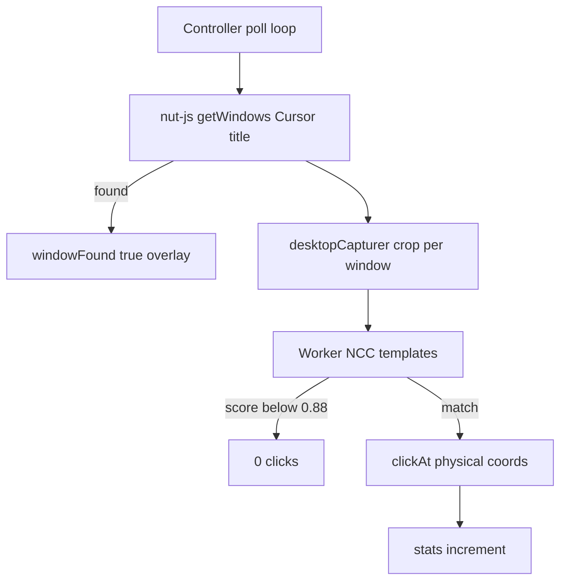

# macOS Auto Run — window found, no clicks

## What we know

Your screenshot matches the failure mode: overlay shows **Auto Run active**, status **“Watching the Cursor window…”** (so [`detector.findCursorWindows()`](src/main/detector.ts) succeeds), but **0 total clicks** (so [`detector.detect()`](src/main/detector.ts) never returns a match above threshold, or clicks never fire).

The two existing plans in [`.cursor/plans/`](.cursor/plans/) are **distribution only** ([Homebrew tap](.cursor/plans/macos_homebrew_tap_422e1349.plan.md), [APT runbook](.cursor/plans/macos_apt_setup_runbook_5b5db71b.plan.md)) — not button detection.

Permissions are already granted to **Cursor Auto Runner** for Screen Recording + Accessibility, so the problem is almost certainly **detection geometry / matching on macOS**, not install.



**Likely root cause:** On macOS, [`@nut-tree-fork/nut-js`](package.json) window `region` may not use the same coordinate space as Electron `display.bounds` / thumbnail crop math in [`captureCrops`](src/main/detector.ts). Window is “found” (title filter passes) but the **crop excludes the Composer Run row**, so even your dark templates never match.

Secondary issues to fix while we’re here:

- [`applyMode`](src/main/main.ts) starts the poll loop **before** `ensureMacPermissions()` resolves (race; harmless for you today but wrong).
- `bestMiss` diagnostics only log at `console.debug` — hard to see in the packaged Brew app.

---

## Release workflow (your rule)

For **each logical task** below:

1. Bump [`package.json`](package.json) patch version (1.2.19 → 1.2.20 → …).
2. Add a dated section under **## [x.y.z]** in [`CHANGELOG.md`](CHANGELOG.md) (project convention: *“each shipped task gets its own version number”*).
3. Update [`landing/index.html`](landing/index.html) badge + download URLs when the version changes (same as [1.2.17](CHANGELOG.md)).
4. **`git commit`** on Mac with a message focused on *why*.
5. **Do not `git push` or tag** until the final acceptance test passes locally.

**Local acceptance test (same as your screenshot setup):**

- Cursor foreground, Composer showing a blue **Run** (and optionally **Always Run** / **Allow**).
- `npm run compile && npm start` **or** `npm run dist:mac` + open `release/mac/Cursor Auto Runner.app` (whichever you’re testing).
- Tray → **Start Auto Run** → within ~10–30 s, overlay **TOTAL CLICKS ≥ 1** and Cursor actually runs/approves.

**Baseline diagnostic (before first code change, read-only):**

```bash
cd /Users/kurtsteven/Projekte/cursor-auto-runner
npm ci && npm run compile
# Cursor visible with Run button on screen:
CURSOR_AUTO_RUNNER_DEBUG_MATCH=1 electron scripts/test-detector.js
```

Record: `cursor window found`, `button detected` (none vs coordinates), `phase metrics` (`cropCount`, `sourceMissCount`, `matchMs`). This tells us whether the next fix is **crop** vs **template scale**.

Optional packaged log tail:

```bash
/Applications/Cursor\ Auto\ Runner.app/Contents/MacOS/Cursor\ Auto\ Runner
```

---

## Task 1 — v1.2.20: macOS detection diagnostics

**Goal:** Make failure visible without guessing.

**Code**

- In [`detector.ts`](src/main/detector.ts): on `darwin`, when `windowFound && crops.length > 0` but no match for several polls, log one throttled `console.warn` with crop size, display `scaleFactor`, and `bestMiss` (promote from debug when env `CURSOR_AUTO_RUNNER_DEBUG_MATCH=1` or new `CURSOR_AUTO_RUNNER_DEBUG_DETECT=1`).
- Extend [`scripts/test-detector.js`](scripts/test-detector.js) to run `run`, `always-run`, and `allow` passes and print `bestMiss` JSON when no hit.

**Docs / version:** 1.2.20 + CHANGELOG “Added macOS detection diagnostics…” + landing bump.

**Commit:** `git commit` — **no push**.

**Gate:** Re-run test-detector; confirm we see **window found** + either a match or a **bestMiss score** near threshold (proves matcher runs).

---

## Task 2 — v1.2.21: macOS window region → Electron crop alignment

**Goal:** Fix wrong crops when nut-js regions are in a different space than Electron bounds (primary fix for 0 clicks).

**Code**

- Add `normalizeWindowRegionForDisplay(region, display)` in [`capture-geometry.ts`](src/main/capture-geometry.ts) (or small `darwin-geometry.ts`) used only when `process.platform === 'darwin'`.
- Apply in [`findCursorWindows`](src/main/detector.ts) after reading `win.region`: convert so `left/top/width/height` align with Electron **logical** `display.bounds` before `intersects` / `captureCrops`.
- Empirical calibration on your machine: log nut region vs expected Composer area once (Task 1 logs), then choose **divide by `scaleFactor`** or **use display-specific offset** — implement the variant that makes `test-detector` return a **Run** hit with your on-screen button.

**Tests**

- Add unit tests in [`tests/capture-geometry.test.ts`](tests/capture-geometry.test.ts) for the normalization helper (fixed inputs; no macOS CI required).

**Docs / version:** 1.2.21 + CHANGELOG “Fixed macOS window crop alignment…” + landing bump.

**Commit:** **no push**.

**Gate:** `test-detector.js` reports **button detected** with Run visible; `npm test` passes.

---

## Task 3 — v1.2.22: macOS window-capture fallback (if Task 2 insufficient)

**Goal:** If nut-js bounds stay unreliable on Sequoia/Tahoe, crop from Electron window thumbnails instead.

**Code**

- On `darwin`, when `desktopCapturer.getSources({ types: ['window'] })` is available, find sources whose name contains `Cursor` (exclude `Auto Runner`), map to display, crop thumbnail to window content — **reuse existing matcher path** with correct [`capturePointToPhysical`](src/main/capture-geometry.ts).
- Keep nut-js path as fallback; prefer window source when it yields a larger valid crop.

**Docs / version:** 1.2.22 + CHANGELOG + landing bump.

**Commit:** **no push**.

**Gate:** Acceptance test — **clicks increment** in overlay with your Composer screenshot layout.

---

## Task 4 — v1.2.23: Permission gate + macOS UX

**Goal:** Hardening; not the main fix for your case but prevents false “running” states.

**Code**

- Change [`applyMode`](src/main/main.ts) to **await** `ensureMacPermissions()` before `controller.set(mode)` when not idle.
- [`permissions.ts`](src/main/permissions.ts): call `systemPreferences.askForMediaAccess('screen')` when status is not granted; add button/deep link for **Accessibility** pane (`Privacy_Accessibility`) in addition to Screen Capture.

**Docs / version:** 1.2.23 + CHANGELOG + landing bump.

**Commit:** **no push**.

**Gate:** Denying permissions keeps mode **idle**; granting both still passes acceptance test.

---

## Task 5 — v1.2.24 (only if needed): Click coordinate verify on macOS

**Goal:** If overlay shows clicks but Cursor doesn’t react, fix **physical vs logical** mismatch in [`capturePointToPhysical`](src/main/capture-geometry.ts) / [`clicker.ts`](src/main/clicker.ts) for Retina.

**Gate:** Mouse visibly hits Run; stats and Cursor both respond.

---

## After local success

1. Run full `npm test`, `npm run test:packaged-worker` (if you built a package).
2. **`git push`** all commits.
3. Tag **`v1.2.24`** (or whatever final patch is) to refresh Brew cask / releases.
4. `brew upgrade --cask cursor-auto-runner` and repeat acceptance test on the **installed** app (permissions are per-binary; dev vs `/Applications` differ).

Update [README.md](README.md) troubleshooting with one row: *“Watching Cursor window but 0 clicks on macOS”* → upgrade past fix version, re-run capture if UI changed.

---

## Files touched (summary)

| Area | Files |
|------|--------|
| Detection | [`src/main/detector.ts`](src/main/detector.ts), [`src/main/capture-geometry.ts`](src/main/capture-geometry.ts) |
| Permissions | [`src/main/main.ts`](src/main/main.ts), [`src/main/permissions.ts`](src/main/permissions.ts) |
| Diagnostics | [`scripts/test-detector.js`](scripts/test-detector.js) |
| Versioning | [`package.json`](package.json), [`CHANGELOG.md`](CHANGELOG.md), [`landing/index.html`](landing/index.html) |
