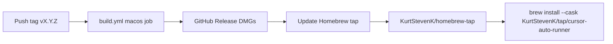

# macOS Homebrew tap — full setup and verify

## Current state

- CI already updates the tap on every **`v*`** tag in [cursor-auto-runner/.github/workflows/build.yml](cursor-auto-runner/.github/workflows/build.yml) (`Update Homebrew tap` step, lines 144–163).
- Cask template: [cursor-auto-runner/packaging/homebrew/cursor-auto-runner.rb](cursor-auto-runner/packaging/homebrew/cursor-auto-runner.rb).
- **Gap:** There is no maintainer doc or macOS smoke test (unlike [cursor-auto-runner/packaging/apt/README.md](cursor-auto-runner/packaging/apt/README.md)).
- **Likely bug to fix in phase C:** CI hashes local artifacts named with **spaces** (`Cursor Auto Runner-${VERSION}.dmg`), while the cask and landing page use **dots** (`Cursor.Auto.Runner-${version}.dmg`). If those are not the same GitHub Release asset, `brew install --cask` will fail checksum or 404.



---

## Phase A — One-time GitHub (browser or `gh` on Mac)

Run from Terminal on macOS (install [GitHub CLI](https://cli.github.com/) if needed: `brew install gh`).

1. **Sign in:** `gh auth login`
2. **Create public tap repo** (empty is fine):
   ```bash
   gh repo create KurtStevenK/homebrew-tap --public --description "Homebrew tap for Cursor Auto Runner"
   ```
   Homebrew maps `KurtStevenK/tap` → this repo (`homebrew-tap` naming convention).
3. **PAT for CI push** (if `TAP_TOKEN` is not already set on `cursor-auto-runner`):
   - GitHub → Settings → Developer settings → Personal access tokens.
   - Classic: scope **`repo`**, or fine-grained: **Contents: Read and write** on **`homebrew-tap`** (and **`apt`** if APT publishing should keep working).
4. **Add secret** on **`KurtStevenK/cursor-auto-runner`**: Settings → Secrets → Actions → **`TAP_TOKEN`** = PAT value.
5. **Populate the tap** (pick one):
   - **Preferred:** push a new tag from your dev machine or re-run the **Build releases** workflow on an existing tag (`v1.2.11`):
     ```bash
     cd path/to/cursor-auto-runner
     git fetch --tags
     git tag v1.2.12   # or re-use existing tag via Actions re-run only
     git push origin v1.2.12
     ```
   - Wait for the **release** job; confirm **Update Homebrew tap** is green.

**Verify on GitHub:** `https://github.com/KurtStevenK/homebrew-tap` contains `Casks/cursor-auto-runner.rb` with real `version` / `sha256` (no `__VERSION__` placeholders).

---

## Phase B — macOS runbook (you run after tap exists)

Prerequisites: Homebrew installed (`/bin/bash -c "$(curl -fsSL https://raw.githubusercontent.com/Homebrew/install/HEAD/install.sh)"`).

1. **Inspect latest release asset names** (canonical filenames):
   ```bash
   VERSION=1.2.11   # latest shipped tag
   gh release view "v${VERSION}" --repo KurtStevenK/cursor-auto-runner --json assets --jq '.assets[].name'
   ```
2. **Install via tap:**
   ```bash
   brew update
   brew install --cask KurtStevenK/tap/cursor-auto-runner
   ```
3. **If checksum error:** compare CI-hashed file vs cask URL:
   ```bash
   # Download the URL from the live cask (intel example)
   curl -fL -o /tmp/cask.dmg "https://github.com/KurtStevenK/cursor-auto-runner/releases/download/v${VERSION}/Cursor.Auto.Runner-${VERSION}.dmg"
   shasum -a 256 /tmp/cask.dmg
   # Compare to sha256 intel: line in homebrew-tap Casks/cursor-auto-runner.rb
   ```
   Repeat for `-arm64.dmg` on Apple Silicon.
4. **Functional smoke:** open **Cursor Auto Runner** from Applications; grant **Screen Recording** and **Accessibility** when prompted; confirm tray icon appears.

Optional maintainer local build (validates DMG names before tagging):
```bash
cd cursor-auto-runner
npm ci && npm run dist:mac
ls -la release/*.dmg
```

---

## Phase C — Repo fixes (Agent mode after plan approval)

Goal: one **canonical DMG basename** everywhere (CI SHA, cask `url`, README, landing, release notes).

1. **Discover truth:** note exact names from `release/*.dmg` after `npm run dist:mac` and from `gh release view` assets list.
2. **Prefer stable dotted names** (already used in README/landing): set electron-builder **`artifactName`** under `build.mac` in [cursor-auto-runner/package.json](cursor-auto-runner/package.json), e.g. pattern that yields:
   - `Cursor.Auto.Runner-${version}.dmg` (x64)
   - `Cursor.Auto.Runner-${version}-arm64.dmg` (arm64)  
   (Use electron-builder variables `${version}`, `${arch}`, `${ext}` — confirm against one local `dist:mac` run.)
3. **Update CI paths** in [build.yml](cursor-auto-runner/.github/workflows/build.yml) `DMG_X64` / `DMG_ARM` to match the new artifact names (replace space-based paths).
4. **Confirm** [packaging/homebrew/cursor-auto-runner.rb](cursor-auto-runner/packaging/homebrew/cursor-auto-runner.rb) URLs already match (or adjust if artifactName differs).
5. **Ship:** bump version + CHANGELOG if needed, tag **`v*`** so CI refreshes the tap with correct digests.

---

## Phase D — Repo artifacts (parity with APT)

Add under `packaging/homebrew/`:

| File | Purpose |
|------|---------|
| **`README.md`** | Maintainer one-time setup (`homebrew-tap`, `TAP_TOKEN`), user install one-liner, local cask render debug, troubleshooting checksum/404 |
| **`smoke-test.sh`** | macOS/bash: takes `VERSION`; fetches live cask from GitHub (or renders template with `sed` like CI); `curl -fL` both DMG URLs; asserts `shasum -a 256` matches cask `sha256` lines; optional `brew style --cask` on rendered file |

Wire a short pointer in [cursor-auto-runner/README.md](cursor-auto-runner/README.md) (distribution / maintainer section) and a CHANGELOG entry under the next patch version.

**Local render (document in README):**
```bash
VERSION=1.2.11
DMG_X64="release/Cursor.Auto.Runner-${VERSION}.dmg"   # after alignment
SHA_X64=$(shasum -a 256 "$DMG_X64" | awk '{print $1}')
# ... same for arm64 ...
sed -e "s/__VERSION__/$VERSION/g" \
    -e "s/__SHA_X64__/$SHA_X64/g" \
    -e "s/__SHA_ARM__/$SHA_ARM/g" \
    packaging/homebrew/cursor-auto-runner.rb
```

---

## Success criteria

- Public repo **`KurtStevenK/homebrew-tap`** with up-to-date `Casks/cursor-auto-runner.rb`.
- **`TAP_TOKEN`** set; release workflow **Update Homebrew tap** succeeds on tag.
- On your Mac: **`brew install --cask KurtStevenK/tap/cursor-auto-runner`** completes without checksum errors.
- **`packaging/homebrew/smoke-test.sh`** passes for the tagged version.
- DMG filenames consistent across **electron-builder output**, **GitHub Release**, **cask URLs**, and **CI SHA step**.

---

## Order of execution (recommended)

1. Phase A (GitHub + first successful tag or workflow re-run).
2. Phase C fixes **before** the next tag if phase B shows checksum/404 mismatch.
3. Phase D docs/scripts in the same PR as phase C (or immediately after).
4. Phase B again on Mac after new tag to confirm end-to-end.
